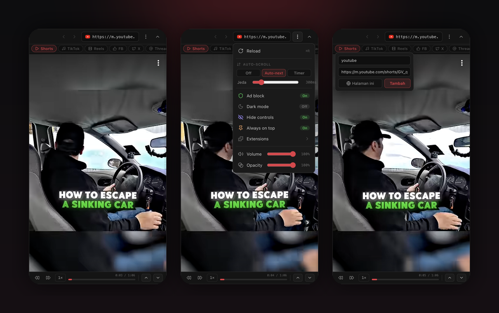
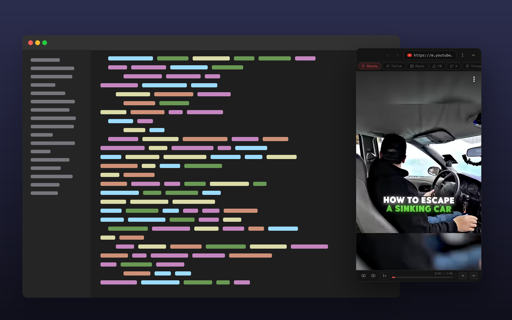

<div align="center">

# 📱 Floatie

**Browser mini melayang (always-on-top) untuk nonton YouTube Shorts, TikTok & Reels sambil kerja.**

Tetap di atas semua jendela, ikut di semua Space, bahkan di atas aplikasi fullscreen di macOS.

<!-- Taruh banner di docs/screenshots/hero.png -->


</div>

---

## ✨ Fitur

- 🪟 **Selalu di atas (always-on-top)** — melayang di atas semua jendela, semua Space, dan aplikasi fullscreen (macOS)
- 📲 **Mini-browser sosial media** — YouTube Shorts, TikTok, Reels, Facebook, X, Threads + **link custom** sendiri
- 🔄 **Auto-scroll** — `Auto-next` (otomatis lanjut saat video selesai, tanpa loop) atau `Timer`
- 🖱️ **Scroll/geser** antar video — jalan di YouTube, Instagram, TikTok (lewat gesture sentuh terpercaya)
- ⏯️ **Kontrol video** — maju/mundur 5 detik, kecepatan 1×/1.5×/2×, progress bar klik-untuk-loncat, tombol video sebelumnya/berikutnya
- 🔊 **Volume khusus aplikasi** — atur volume tanpa memengaruhi volume sistem atau app lain
- 🔈 **Autoplay bersuara** — video langsung jalan dengan suara
- 🛡️ **Ad block** — blokir iklan & tracker level jaringan
- 🌙 **Dark mode** — paksa tema gelap di situs yang tidak punya
- 👁️ **Sembunyikan kontrol situs** — tombol bawaan YouTube/TikTok auto-hilang saat idle, muncul saat gerakkan mouse
- 🧩 **Dukungan extension** — import extension dari Chrome / Brave / Edge
- 🎚️ **Opacity window** — atur transparansi
- ⌨️ **Shortcut keyboard** lengkap (lihat di bawah)

---

## 📸 Tampilan

Melayang di atas aplikasi lain — nonton sambil tetap kerja.



---

## ⬇️ Download & Install

Ambil file terbaru dari halaman **[Releases](../../releases)**.

### 🍎 macOS

| Pilihan | File | Cocok untuk |
|---|---|---|
| **Universal** (disarankan) | `Floatie-1.0.0-universal.dmg` | Semua Mac (Intel + Apple Silicon) |
| Apple Silicon | `Floatie-1.0.0-arm64.dmg` | Mac M1/M2/M3/M4 (file lebih kecil) |

**Langkah:**
1. Buka file `.dmg`, lalu **drag Floatie ke folder Applications**.
2. Buka aplikasi.

> ⚠️ **Muncul "Floatie is damaged / can't be opened"?**
> Itu bukan aplikasi rusak — hanya Gatekeeper macOS karena aplikasi belum di-*notarize* (butuh Apple Developer Program berbayar). Lewati dengan **salah satu** cara:
>
> **A. Terminal (paling ampuh):**
> ```bash
> xattr -cr /Applications/Floatie.app
> ```
> Lalu buka aplikasi seperti biasa.
>
> **B. Klik-kanan:** klik-kanan ikon aplikasi → **Open** → **Open**.
>
> **C. System Settings:** coba buka sekali (diblokir) → **System Settings → Privacy & Security** → tombol **"Open Anyway"**.

### 🪟 Windows

1. Download `Floatie Setup 1.0.0.exe`.
2. Jalankan installer-nya.

> ⚠️ Muncul **"Windows protected your PC" (SmartScreen)?** Klik **More info → Run anyway**. Wajar untuk aplikasi yang belum punya sertifikat code-signing.

---

## ⌨️ Shortcut Keyboard

| Tombol | Aksi |
|---|---|
| `←` / `→` | Mundur / maju **5 detik** |
| `↑` / `↓` | Video **sebelumnya / berikutnya** |
| `Cmd/Ctrl + R` | Reload |
| `Cmd/Ctrl + [` | Back |
| `Cmd/Ctrl + ]` | Forward |
| `Cmd/Ctrl + L` | Fokus ke kolom URL |

Sembunyikan/tampilkan toolbar lewat tombol **˄** di kanan toolbar, dan tab kecil di tengah-atas untuk memunculkannya lagi.

---

## 🛠️ Build dari Source

**Prasyarat:** Node.js 20.19+ atau 22.12+

```bash
# 1. Install dependency (otomatis sekalian download binary Electron)
npm install

# 2. Jalankan mode development
npm run dev

# 3. Build installer
npm run build:mac   # → DMG (arm64 + universal) di folder dist/
npm run build:win   # → EXE (Windows x64) di folder dist/
```

> 💡 Tidak punya Apple Developer ID? Tidak masalah untuk pemakaian pribadi — installer tetap jalan (lihat catatan Gatekeeper di atas).

---

## 🧰 Tech Stack

- [Electron](https://www.electronjs.org/) 42 — runtime desktop
- [electron-vite](https://electron-vite.org/) 5 + [Vite](https://vite.dev/) 7 — build tooling
- [Svelte 5](https://svelte.dev/) (Runes) — UI
- [UnoCSS](https://unocss.dev/) — styling
- [@cliqz/adblocker-electron](https://github.com/ghostery/adblocker) — ad block
- [electron-store](https://github.com/sindresorhus/electron-store) — penyimpanan setelan
- [electron-builder](https://www.electron.build/) — paketisasi DMG/EXE

---

## 📄 Lisensi

Tambahkan lisensi pilihanmu (mis. MIT) di sini.
